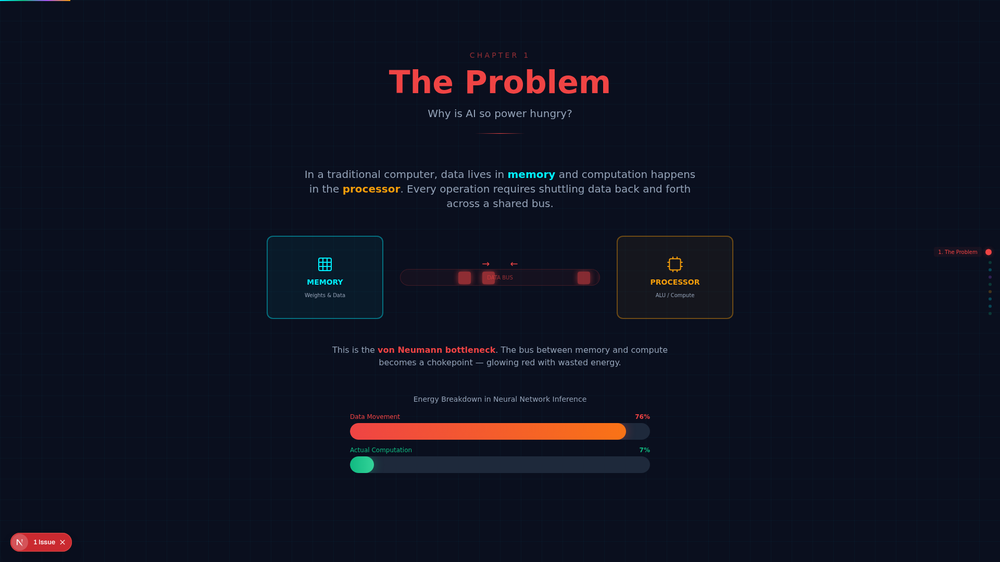
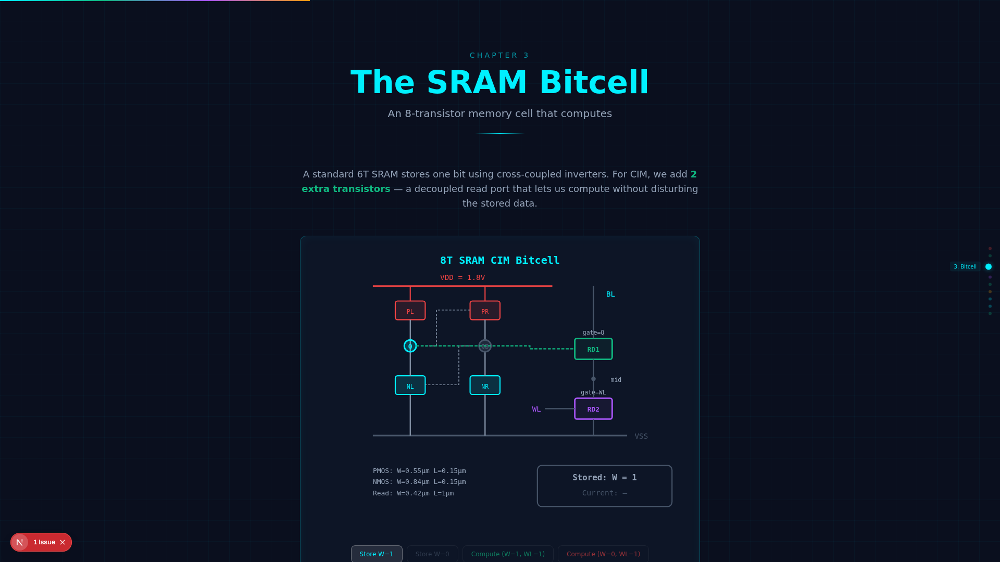
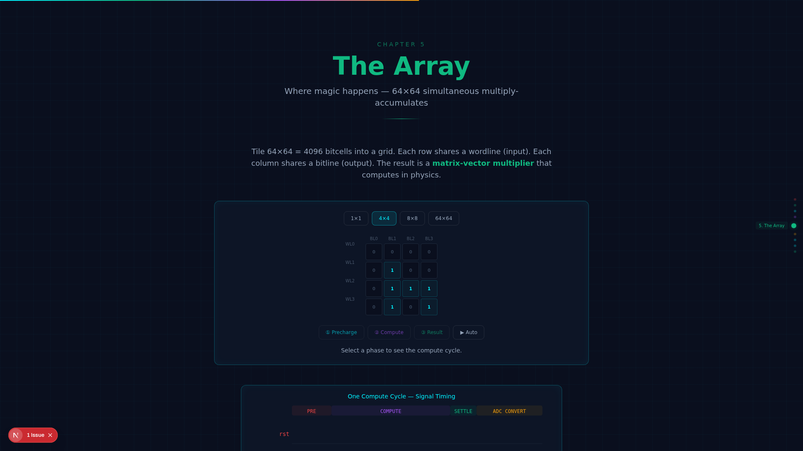
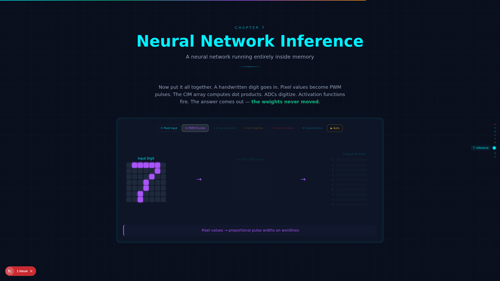

# CIM Chip Explainer - Interactive Animated Experience

An interactive scroll-driven educational experience explaining how Compute-in-Memory (CIM) chips perform neural network inference using analog physics. Built from **real SPICE measurements** of a SKY130 130nm CMOS chip design.

## Current State

| Chapter | Status | Interactive Elements |
|---------|--------|---------------------|
| 1. The Problem (von Neumann) | Complete | Animated data bus, energy counter bars |
| 2. Key Insight (Ohm/KCL) | Complete | Interactive resistor slider, toggleable KCL cells, dot product grid |
| 3. 8T SRAM Bitcell | Complete | 4-phase transistor diagram, SPICE netlist, scale bar |
| 4. PWM Driver | Complete | 16-code waveform display, interactive code slider |
| 5. 64×64 Array | Complete | Scalable grid (1×1 to 64×64), 3-phase compute cycle, timing diagram |
| 6. SAR ADC | Complete | Step-by-step SAR binary search with play/pause |
| 7. Neural Network Inference | Complete | 6-phase pipeline (auto-plays on scroll), digit recognition |
| 8. Full Chip | Complete | Exploded layer view, data flow diagram, transistor/timing budgets |
| 9. Why This Matters | Complete | Power comparison bars, energy per inference, application cards |

**UI Features**: Particle background, scroll progress bar, floating chapter nav, smooth scroll

## Screenshots

### Hero


### Chapter 1: The Von Neumann Bottleneck


### Chapter 3: The 8T SRAM Bitcell


### Chapter 5: The CIM Array


### Chapter 7: Neural Network Inference


### Chapter 9: Why This Matters


## What's New
- **v5**: Auto-play Ch7 inference, energy comparison in Ch9, data flow diagram in Ch8, scale bar in Ch3
- **v4**: Interactive dot product grid in Ch2, SPICE netlist in Ch3, transistor/timing budgets in Ch8
- **v3**: Animated timing diagram in Ch5, particle background, scroll progress, chapter nav
- **v2**: Fixed label overlaps, text cutoff, added Puppeteer screenshots
- **v1**: All 9 chapters with interactive visualizations and real chip data

## Tech Stack
- **Next.js 16** with TypeScript and Tailwind CSS
- **Framer Motion** for scroll-triggered animations and transitions
- **HTML5 Canvas** for particle field background
- **SVG** for circuit diagrams, waveforms, and data visualizations
- **Puppeteer** for automated screenshots

## Real Chip Data Used
All numbers come from actual SPICE simulations of the SKY130 CIM design:
- **Bitcell**: I_read=28.36µA, I_leak=0.002nA, ON/OFF=14.9M, cell area=1.383µm², 8T
- **PWM Driver**: T_LSB=5.0ns, linearity=0.026%, rise=0.148ns, 6 transistors
- **SAR ADC**: 6-bit, 108ns conversion, ENOB=6.0, 5.1µW, 685fF DAC
- **Full Tile**: 64×64 array, <500ns compute, <10mW power, ~36.6K transistors

## Component Architecture
```
app/
├── page.tsx                    # Main scroll experience
├── components/
│   ├── HeroSection.tsx         # Landing with particle bg
│   ├── ChapterNav.tsx          # Floating dot navigation
│   ├── ScrollProgress.tsx      # Top progress bar
│   ├── chipData.ts             # Real measurements constants
│   ├── chapters/               # 9 chapter components (<600 lines each)
│   │   ├── Chapter1.tsx ... Chapter9.tsx
│   ├── ui/                     # Shared UI components
│   │   ├── ScrollReveal.tsx, GlowCard.tsx, ChapterHeader.tsx, AnimatedCounter.tsx
│   └── anim/                   # Animation components
│       ├── ParticleField.tsx, TimingDiagram.tsx, DotProductGrid.tsx, DataFlowDiagram.tsx
```

## Running Locally

```bash
cd website
npm install
npm run dev
```

## Taking Screenshots

```bash
cd website
node screenshot.js
```
